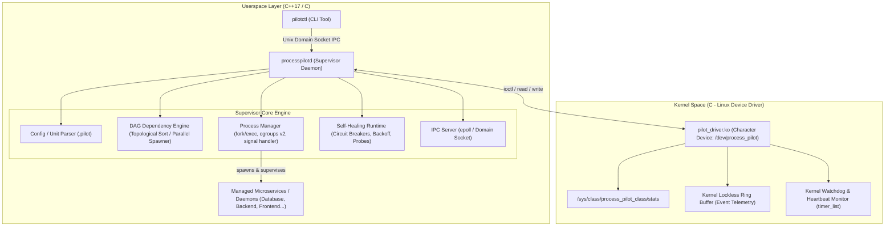

# ProcessPilot Pro: Dependency-Aware Linux Service Supervisor with Self-Healing Runtime

[](https://en.wikipedia.org/wiki/C%2B%2B17)
[](https://www.kernel.org/)
[](docs/DRIVER_DESIGN.md)
[](LICENSE)

**ProcessPilot Pro** is a high-reliability Linux service supervisor, dependency-aware process orchestrator, and self-healing runtime with an integrated Linux Character Device Driver (`pilot_driver`) for hardware/kernel-assisted watchdogs, out-of-band health monitoring, and crash telemetry.

---

## 🌟 Key Features

### 1. ⚙️ Linux Kernel Device Driver (`pilot_driver.ko`)
- **Character Device `/dev/process_pilot`**: Dynamic major allocation, `/sys/class/process_pilot_class/stats` sysfs telemetry tree.
- **Kernel Watchdog Timer**: Hard kernel-space timers (`struct timer_list`) delivering millisecond-precision heartbeat monitoring. If user-space deadlocks, the kernel emits out-of-band alerts.
- **Lockless Event Ring Buffer**: Circular event queue supporting `poll()` / `POLLIN` and non-blocking `read()` for asynchronous crash notifications.
- **IOCTL Interface**: Secure ioctl contracts for watchdog registration, heartbeat pings, fault injection, and telemetry retrieval.

### 2. 🌲 DAG Dependency Engine & Parallel Boot
- **Directed Acyclic Graph (DAG)**: Resolves complex multi-service relationships (`Requires=`, `Wants=`).
- **Topological Sorting & Cycle Detection**: Kahn's algorithm resolves startup orders; DFS detects circular dependency loops at boot time.
- **Tiered Parallel Launch**: Automatically groups independent nodes into parallel execution tiers, maximizing multicore concurrency.

### 3. 🛡️ Self-Healing Runtime & Failure Policies
- **Jittered Exponential Backoff**: Computes $\text{delay} = \min(\text{max\_backoff}, \text{initial} \times 2^{\text{restarts}}) \pm 10\%\text{ jitter}$ to prevent thundering herd problems.
- **Crash-Loop Circuit Breaker**: Automatically trips if a service crashes $\ge N$ times within a sliding window $T$, preventing fork-bomb resource starvation.
- **Multi-Modal Health Probes**: Kernel driver watchdog pings, TCP socket probes, HTTP health probes, and executable command probes.

### 4. 📦 Process Isolation & cgroups v2 Control
- **POSIX Signal & Process Isolation**: Independent process groups (`setpgid`), zombie reaping (`waitpid WNOHANG`), non-blocking stdout/stderr log capture.
- **Linux cgroups v2 Integration**: Native resource limits (`memory.max`, `cpu.max`, `pids.max`) and live resource telemetry from `/proc/<pid>/stat` and `/proc/<pid>/status`.

### 5. 🎛️ Unix Domain Socket IPC & CLI (`pilotctl`)
- **Interactive Control CLI**: `pilotctl status`, `pilotctl tree`, `pilotctl start`, `pilotctl stop`, `pilotctl restart`, `pilotctl logs`, `pilotctl driver-stats`, `pilotctl inject-fault`, and `pilotctl reset-circuit`.

---

## 📐 Architecture Diagram



---

## 📁 Repository Structure

```
process-pilot/
├── CMakeLists.txt                 # CMake configuration for userspace binaries
├── Makefile                       # Top-level Master Makefile
├── README.md                      # Complete project overview & documentation
├── LICENSE                        # MIT License
├── include/
│   ├── common/
│   │   ├── pilot_types.hpp        # Core models, ServiceState, telemetry structs
│   │   ├── logger.hpp             # Structured color logger
│   │   └── error_codes.hpp        # Status codes
│   ├── driver/
│   │   └── pilot_ioctl.h          # Shared userspace/kernel IOCTL contracts
│   ├── engine/
│   │   ├── dag_resolver.hpp       # DAG graph, topological sort, cycle detection
│   │   ├── process_manager.hpp    # Process lifecycle, cgroups v2, zombie reaper
│   │   ├── health_checker.hpp     # Probes (Kernel Watchdog, TCP, HTTP, Exec)
│   │   └── self_healer.hpp        # Exponential backoff & circuit breaker
│   ├── ipc/
│   │   ├── ipc_protocol.hpp       # IPC request/response serialization
│   │   ├── ipc_server.hpp         # Unix domain socket server
│   │   └── ipc_client.hpp         # Unix domain socket client
│   └── parser/
│       └── config_parser.hpp      # .pilot unit configuration parser
├── src/
│   ├── driver/                    # Linux Kernel Module
│   │   ├── Kbuild                 # Kernel build configuration
│   │   ├── Makefile               # Driver makefile
│   │   ├── pilot_driver.c         # Character device, timer_list, ring buffer
│   │   └── pilot_driver.h         # Driver internal headers
│   ├── daemon/                    # processpilotd daemon binary
│   │   ├── main.cpp               # Daemon main entry point & signal handling
│   │   ├── supervisor.hpp         # Central supervisor engine header
│   │   ├── supervisor.cpp         # Supervision loop & IPC command dispatch
│   │   ├── config_parser.cpp      # Unit parser implementation
│   │   ├── dag_resolver.cpp       # Topological sort & tier computation
│   │   ├── process_manager.cpp    # Fork/exec, cgroups v2 limits
│   │   ├── health_checker.cpp     # Health check probe runners & ioctl client
│   │   ├── self_healer.cpp        # Backoff & circuit breaker logic
│   │   └── ipc_server.cpp         # Unix domain socket server event loop
│   ├── cli/                       # pilotctl CLI binary
│   │   ├── main.cpp               # CLI entry point
│   │   ├── cli_commands.hpp       # Command handlers header
│   │   └── cli_commands.cpp       # CLI client commands implementation
│   └── common/
│       └── logger.cpp             # Logger implementation
├── services.d/                    # Sample Service Units
│   ├── database.pilot             # Database service unit config
│   ├── backend.pilot              # Backend API unit config (Requires=database)
│   ├── frontend.pilot             # Frontend gateway unit config (Requires=backend)
│   ├── telemetry.pilot            # Telemetry daemon with Kernel Watchdog
│   └── mock_service.c             # Mock worker binary source
├── tests/                         # Automated Test Suite
│   ├── test_dag.cpp               # Unit tests: DAG topological sort & cycles
│   ├── test_parser.cpp            # Unit tests: .pilot unit parser
│   ├── test_healer.cpp            # Unit tests: Exponential backoff & breaker
│   ├── test_driver_harness.cpp    # Kernel driver ioctl test harness
│   └── test_integration.sh        # End-to-end integration test runner
├── scripts/
│   ├── build.sh                   # One-click build script
│   ├── load_driver.sh             # Load pilot_driver.ko and configure /dev/
│   ├── unload_driver.sh           # Unload pilot_driver.ko
│   └── demo_self_healing.sh       # Interactive live chaos and recovery demo
└── docs/
    ├── ARCHITECTURE.md            # Hardware & Software architectural breakdown
    ├── DRIVER_DESIGN.md           # Kernel module architecture & IOCTL reference
    └── EVALUATION_GUIDE.md        # 5-10 minute presentation & demo walkthrough
```

---

## 🚀 Quick Start Guide

### Prerequisites
- **Operating System**: Linux (Ubuntu 20.04+, Debian 11+, RHEL 8+, Arch Linux, or WSL2 with kernel headers)
- **Compiler**: GCC 9+ or Clang 10+ (`C++17` and `C11` support)
- **Build Tools**: `cmake` (3.14+), `make`, `build-essential`
- **Linux Kernel Headers**: `linux-headers-$(uname -r)` (for kernel module compilation)

### 1. Build Everything
```bash
# Clone and build
git clone https://github.com/your-username/process-pilot.git
cd process-pilot
make all
```

### 2. (Optional) Load Linux Kernel Driver
```bash
sudo make load_driver
```
*Note: If running in an environment without root or custom kernel headers, ProcessPilot Pro gracefully runs with software health probing.*

### 3. Run Automated Unit Tests
```bash
make test
```

### 4. Run the Live Self-Healing & Chaos Demo
```bash
make demo
```

---

## 💻 CLI Usage (`pilotctl`)

```bash
# View live status table with CPU, Memory, and Uptime metrics
./bin/pilotctl status

# Display ASCII DAG dependency tree
./bin/pilotctl tree

# Query Linux Kernel Driver telemetry
./bin/pilotctl driver-stats

# Manually start, stop, or restart a service
./bin/pilotctl stop frontend
./bin/pilotctl start frontend
./bin/pilotctl restart database

# View captured service stdout/stderr logs
./bin/pilotctl logs backend

# Hot-reload unit configuration files without restarting daemon
./bin/pilotctl reload

# Inject chaos / fault to verify self-healing
./bin/pilotctl inject-fault database

# Reset tripped circuit breaker
./bin/pilotctl reset-circuit database
```

---

## 📜 Unit Configuration Syntax (`.pilot`)

Service units are defined in `services.d/` with clear, INI-style syntax:

```ini
[Unit]
Description=Primary Database Service
Requires=
Wants=
AutoStart=true

[Service]
ExecStart=./bin/pilot_mock_svc database
WorkingDirectory=.
Restart=exponential-backoff
Environment=DB_PORT=5432;WORKERS=4

[HealthCheck]
Type=exec
Endpoint=true
IntervalMs=2000
TimeoutMs=1000
MaxRetries=3

[SelfHealing]
InitialBackoffMs=500
MaxBackoffMs=15000
BackoffMultiplier=2.0
MaxCrashCount=5
CrashWindowSec=60

[ResourceLimits]
MemoryMaxBytes=536870912
CpuQuotaPct=80
MaxPids=50
```

---

## 🎓 Capstone Project Requirements Compliance

| Requirement | Specification | Implementation Verification |
| :--- | :--- | :--- |
| **1. Programming Language** | Only C/C++ permitted | **100% C++17 and C11/C23**. No Python, Java, or external runtime dependencies. |
| **2. Operating System** | Exclusively on Linux OS | Built on POSIX Linux APIs (`epoll`, `fork`, `execvp`, `signalfd`, `/proc`, cgroups v2). |
| **3. Linux Device Drivers** | Linux Device Driver concepts incorporated | Custom Linux Character Device Driver (`pilot_driver.ko`), `/dev/process_pilot`, `ioctl`, `timer_list` watchdogs, ring buffer, sysfs attributes. |
| **4. Project Scope** | Software/Hardware Architecture concepts | Systems Programming, Kernel Module, DAG topological sort, IPC, cgroups v2 resource control, Self-healing runtime. |
| **5. GitHub Submission** | Proper structure, README, docs, instructions | Complete structured repository with full source code, test suites, and documentation. |
| **6. Evaluation Ready** | 5-10 min evaluation walkthrough | Complete [EVALUATION_GUIDE.md](docs/EVALUATION_GUIDE.md) prepared with step-by-step presentation notes. |

---

## 📄 License
This project is licensed under the MIT License - see the [LICENSE](LICENSE) file for details.
