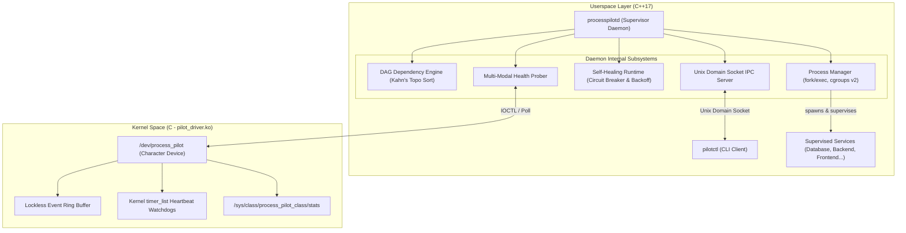
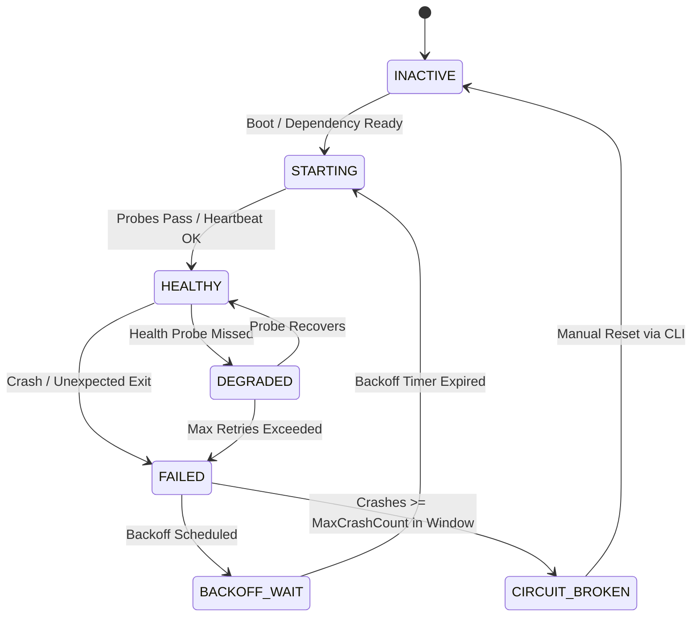

# ProcessPilot Pro: Software & Hardware Architecture Specification

## 1. System Overview

ProcessPilot Pro bridges low-level Linux kernel capabilities with modern userspace systems programming to build an enterprise-grade service supervisor.



---

## 2. Graph Theory & DAG Scheduling Engine

ProcessPilot Pro models service interdependencies as a Directed Acyclic Graph $G = (V, E)$, where $V$ represents the set of configured services and directed edges $(u, v) \in E$ indicate that service $u$ depends on service $v$ ($v$ must be active and healthy before $u$ can boot).

### A. Topological Sorting (Kahn's Algorithm)
1. Compute the in-degree of all nodes $v \in V$ (number of incoming dependency requirements).
2. Enqueue all nodes with in-degree = 0 into queue $Q$.
3. While $Q$ is not empty:
   - Dequeue node $u$, append to execution order $L$.
   - For each node $w$ dependent on $u$, decrement in-degree of $w$.
   - If in-degree of $w$ becomes 0, enqueue $w$ into $Q$.
4. If $|L| \neq |V|$, a dependency cycle exists.

### B. Parallel Execution Tiers
Rather than sequential execution, the engine groups nodes into discrete execution tiers:
$$\text{Tier}(v) = \begin{cases} 0 & \text{if } \text{InDegree}(v) = 0 \\ 1 + \max_{u \in \text{Deps}(v)} \text{Tier}(u) & \text{otherwise} \end{cases}$$

Nodes within the same tier are dispatched concurrently, maximizing multicore boot performance.

---

## 3. Process Lifecycle & OS Isolation

### A. Process Group Isolation
To avoid stray child processes when a service spawns subprocesses, ProcessPilot calls:
```c
setpgid(0, 0);
```
Signals (`SIGTERM`, `SIGKILL`) are dispatched to the negative process group ID (`kill(-pid, SIGTERM)`), ensuring all descendants terminate cleanly.

### B. Non-Blocking Zombie Harvesting
Process exits are non-blockingly harvested using:
```c
waitpid(-1, &status, WNOHANG);
```
Exit statuses are decoded via `WIFEXITED(status)` and `WTERMSIG(status)` to distinguish between normal terminations, software errors, and forced signal terminations (`SIGKILL`/`SIGSEGV`).

### C. Linux cgroups v2 Controller
When `/sys/fs/cgroup` is mounted, ProcessPilot creates isolated cgroups under `/sys/fs/cgroup/processpilot/<service>`:
- **`memory.max`**: Hard memory ceiling in bytes.
- **`cpu.max`**: CPU bandwidth limit (e.g. `50000 100000` = 50% single-core allocation).
- **`pids.max`**: Fork-bomb mitigation limit.

---

## 4. Self-Healing Runtime Engine



### A. Exponential Backoff with Jitter
To prevent cascading restart storms (thundering herd), restart delay $D$ is computed as:
$$D = \min\left(D_{\text{max}}, D_{\text{initial}} \times (\text{Multiplier})^{\text{restarts}-1}\right) \times U(0.9, 1.1)$$
where $U(0.9, 1.1)$ is a uniform random jitter distribution.

### B. Sliding Window Circuit Breaker
- Maintains a timestamp deque $T_{\text{crashes}}$ for each service.
- Crashes older than $W_{\text{window}}$ seconds are pruned.
- If $|T_{\text{crashes}}| \ge N_{\text{max}}$, the circuit breaker trips, transitioning the service state to `CIRCUIT_BROKEN` and halting automatic restarts until an operator intervenes.
