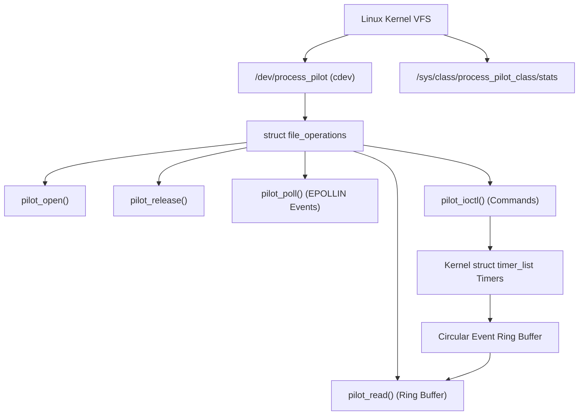

# Linux Kernel Device Driver Architecture (`pilot_driver`)

## 1. Overview
The ProcessPilot Pro kernel driver (`pilot_driver.ko`) is a custom Linux character device driver registering `/dev/process_pilot` and exposing out-of-band kernel watchdog timers, telemetry ring buffers, and fault injection hooks.

---

## 2. Character Device Registration & Hierarchy



### Dynamic Registration Flow
1. **Dynamic Number Allocation**: `alloc_chrdev_region(&ctx.dev_num, 0, 1, "process_pilot")` assigns dynamic major/minor numbers.
2. **Character Device Setup**: `cdev_init(&ctx.cdev, &pilot_fops)` links file operations, and `cdev_add()` registers it with the VFS.
3. **Device Class & Sysfs Creation**: `class_create("process_pilot_class")` creates `/sys/class/process_pilot_class/` and creates the `stats` read-only sysfs file.
4. **Device Node Creation**: `device_create()` automatically generates `/dev/process_pilot` via udev.

---

## 3. Kernel Watchdog Timer Mechanism

Monitored processes are tracked via `struct pilot_monitored_proc` containing a kernel `struct timer_list`:

```c
struct pilot_monitored_proc {
    struct list_head    list;
    pid_t               pid;
    char                service_name[PILOT_MAX_NAME_LEN];
    uint32_t            timeout_ms;
    uint32_t            max_misses;
    uint32_t            current_misses;
    struct timer_list   watchdog_timer;
    bool                fault_injected;
    bool                active;
};
```

### Expiration Callback
When a monitored process fails to send a heartbeat ping before `timeout_ms`:
1. The kernel timer callback `pilot_watchdog_timer_callback` is executed in softirq context.
2. `current_misses` is incremented.
3. If `current_misses >= max_misses`, a `PILOT_EVENT_WATCHDOG_EXPIRED` event is generated and pushed to the circular ring buffer.
4. If misses < max, a `PILOT_EVENT_HEARTBEAT_MISSED` warning event is emitted and the timer is rescheduled.

---

## 4. Circular Event Ring Buffer & Polling

- **Capacity**: Fixed-size circular array of 256 `struct pilot_event` elements.
- **Concurrency**: Protected by a high-performance IRQ-safe spinlock (`spinlock_t ring_lock`).
- **Wait Queues**: Supports `poll()` / `epoll()` via `wait_queue_head_t read_wait`. When an event is pushed, `wake_up_interruptible()` notifies all waiting userspace processes.

---

## 5. IOCTL Interface Reference

| IOCTL Command | Code | Argument | Description |
| :--- | :--- | :--- | :--- |
| `PILOT_IOCTL_REGISTER_WATCHDOG` | `_IOW('P', 1, ...)` | `struct pilot_watchdog_reg` | Registers a process PID, deadline, and service name in kernel space. |
| `PILOT_IOCTL_UNREGISTER_WATCHDOG` | `_IOW('P', 2, ...)` | `pid_t` | Cancels timer and unregisters watchdog. |
| `PILOT_IOCTL_PING_HEARTBEAT` | `_IOW('P', 3, ...)` | `struct pilot_heartbeat_ping` | Resets the watchdog timer deadline and increments heartbeat counter. |
| `PILOT_IOCTL_GET_STATS` | `_IOR('P', 4, ...)` | `struct pilot_driver_stats` | Retrieves real-time kernel telemetry counters. |
| `PILOT_IOCTL_INJECT_FAULT` | `_IOW('P', 5, ...)` | `struct pilot_fault_inject` | Simulates synthetic heartbeat drops or driver delay. |
| `PILOT_IOCTL_RESET_STATS` | `_IO('P', 6)` | None | Resets all driver counters to zero. |

---

## 6. Sysfs Telemetry Interface

Reading `/sys/class/process_pilot_class/stats` returns live telemetry:

```bash
$ cat /sys/class/process_pilot_class/stats
ProcessPilot Driver Status:
  Version: 1.0
  Active Watchdogs: 2
  Heartbeats Received: 1420
  Watchdogs Registered: 4
  Watchdogs Expired: 0
  Missed Deadlines: 1
  Events Queued: 1421
  Events Dropped: 0
```
