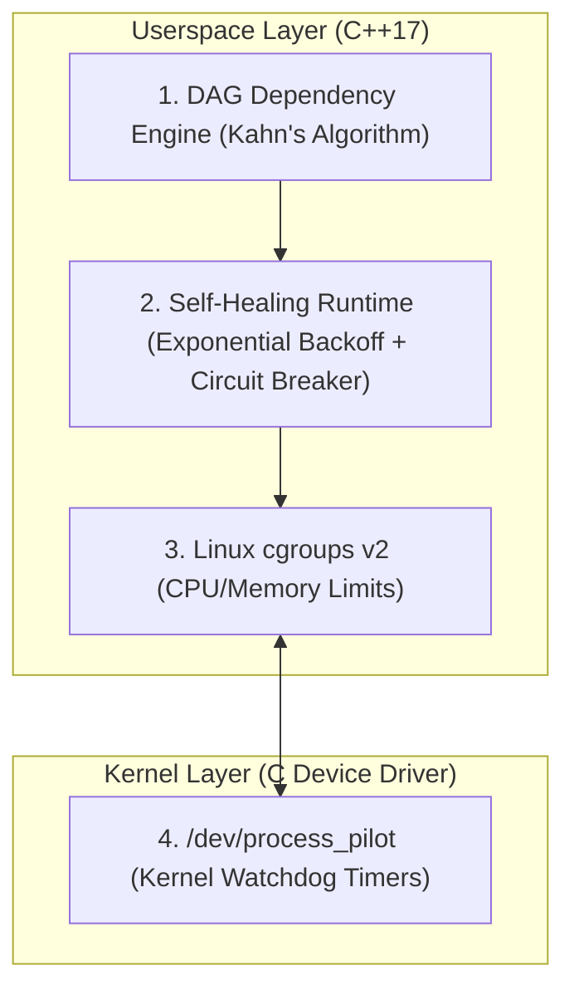

# 🎓 ProcessPilot Pro: Capstone Project Report & Interview Presentation Guide

---

## 📌 1. Project Title & 30-Second Elevator Pitch

> **Project Name:**  
> **ProcessPilot Pro: Dependency-Aware Linux Service Supervisor with Self-Healing Runtime & Kernel Device Driver**
>
> **Programming Language:** 100% C++17 & C11 (Zero Python, Zero Java)  
> **Target Platform:** Linux Operating System (POSIX APIs & Linux Kernel)  
> **GitHub Repository:** [https://github.com/Shourya-h3/ProcessPilot-Pro](https://github.com/Shourya-h3/ProcessPilot-Pro)

### 🎙️ How to Introduce Your Project (Say this to your interviewer):
> *"Good morning/afternoon. My capstone project is **ProcessPilot Pro**. It is an intelligent service supervisor and process orchestrator built from scratch in C++ and C for Linux.*  
> *It does three main things:*  
> 1. *It boots complex backend microservices in the exact right order using a **Directed Acyclic Graph (DAG)**.*  
> 2. *It automatically detects crashes and **self-heals** services using exponential backoff and circuit breakers.*  
> 3. *It includes a custom **Linux Character Device Driver** (`/dev/process_pilot`) that provides kernel-level watchdog timers so we can monitor service health even if userspace completely freezes."*

---

## ❓ 2. The Real-World Problem We Are Solving

### 🏢 Real-World Scenario:
Imagine you are running a food delivery app like **Swiggy** or **Zomato**:
- You have 4 programs:
  1. `Database` (stores restaurant data and user accounts).
  2. `Payment Gateway` (needs Database to verify cards).
  3. `Order API` (needs Payment Gateway and Database).
  4. `Web Frontend UI` (needs Order API to show food menus).

### ❌ What goes wrong in traditional systems?
1. **Wrong Startup Order:** If the Frontend starts *before* the Database is ready, users get a "500 Internal Server Error" crash.
2. **Cascading Crashes:** If someone kills the Database, all other services start crashing in an infinite loop, burning 100% CPU.
3. **Silent Deadlocks:** If a service gets stuck in an infinite loop (deadlock), userspace tools think the PID is alive, but it's actually completely frozen.

### ✅ How ProcessPilot Pro Solves This:
- ProcessPilot Pro builds a **dependency graph**, boots services in **parallel tiers**, monitors them via a **Linux Kernel Watchdog**, and automatically **heals** any crashed process without human intervention.

---

## 🧠 3. Step-by-Step Core Concepts with Practical Examples



---

### 🌲 Concept 1: DAG Dependency Engine & Kahn's Algorithm

#### 💡 Practical Example: "Baking a Cake"
You cannot put icing on a cake before baking it, and you cannot bake it before mixing the batter.
- **Batter** ➡️ **Bake** ➡️ **Icing**.
- In our project: **Database** ➡️ **Backend** ➡️ **Frontend**.

#### 🔍 How it Works in Code (`src/daemon/dag_resolver.cpp`):
1. **Kahn's Topological Sort:**  
   - We calculate "how many dependencies each service needs" (in-degree).
   - Independent services with 0 dependencies (`Database`, `Telemetry`) start in **Tier 0**.
   - Services depending on Tier 0 (`Backend`) start in **Tier 1**.
   - Services depending on Tier 1 (`Frontend`) start in **Tier 2**.
2. **Cycle Detection (The Chicken and Egg Trap):**  
   - If Service A needs B, B needs C, and C needs A, they will wait forever.
   - ProcessPilot Pro runs a cycle-detection check using Depth First Search (DFS) and immediately alerts:  
     `Dependency Cycle Detected: A -> B -> C -> A` and refuses to boot broken configurations.

---

### 🏥 Concept 2: Linux Kernel Device Driver (`/dev/process_pilot`)

#### 💡 Practical Example: "The ICU Heart Monitor"
In a hospital ICU, if a patient's heart stops beating for 5 seconds, an alarm beeps immediately.
Even if the doctor falls asleep, the hardware machine stays alert.

#### 🔍 How it Works in Code (`src/driver/pilot_driver.c`):
1. We wrote a custom Linux Kernel Module that registers a character device at `/dev/process_pilot`.
2. When a critical service starts, it sends an `IOCTL` command to the Linux kernel:  
   *"Hey Linux Kernel, my PID is 14820. If I don't send you a heartbeat ping every 1000 ms, sound the alarm!"*
3. The kernel driver uses hard kernel timers (`struct timer_list`). If a service deadlocks, the kernel emits an out-of-band alert through its circular event ring buffer.
4. Anyone can view live driver stats via the Linux `sysfs` filesystem:
   ```bash
   cat /sys/class/process_pilot_class/stats
   ```

---

### 🛡️ Concept 3: Self-Healing Runtime (Exponential Backoff & Circuit Breaker)

#### 💡 Practical Example 1: "Calling a Busy Friend (Exponential Backoff)"
If you call your friend and their line is busy:
- You don't call 50 times in 1 second (that's spamming).
- You wait 1 second, then 2 seconds, then 4 seconds, then 8 seconds.
- In ProcessPilot Pro: When a service crashes, we delay the restart:
  $$\text{Delay} = \text{Initial Delay} \times 2^{\text{restarts}} \pm \text{Random Jitter}$$
  The **random jitter** prevents 10 crashed services from all restarting at the exact same millisecond.

#### 💡 Practical Example 2: "Home Electricity Fuse (Circuit Breaker)"
If there is a short circuit in your room, the electrical fuse trips to prevent your house from catching fire.
- In ProcessPilot Pro: If a bug causes a service to crash **5 times in 60 seconds**, ProcessPilot trips the **Circuit Breaker** and sets status to `CIRCUIT_BROKEN`.
- This stops the computer's CPU from getting overwhelmed. Once you fix the bug, you run `pilotctl reset-circuit` to turn it back on.

---

### 📦 Concept 4: Process Management & Linux cgroups v2

#### 💡 Practical Example: "Roommates Sharing 100 Mbps WiFi"
If 4 roommates share WiFi, one person downloading huge games shouldn't make everyone else lag.
- In ProcessPilot Pro: We connect directly to Linux **cgroups v2** (`/sys/fs/cgroup/processpilot/`):
  - `memory.max = 512 MB`: The service can never use more than 512 MB RAM.
  - `cpu.max = 50%`: The service cannot hog more than 50% of a CPU core.
  - `setpgid(0, 0)`: Isolates child processes so no "ghost/zombie" processes remain after shutdown.

---

## 🎬 4. How to Demo This in Front of Your Interviewer (Step-by-Step)

Here is your exact demonstration script. You can run `.\run_demo.bat` (or on Linux `make demo`).

```
+-------------------------------------------------------------------------+
|                  WHAT YOU DO                    |      WHAT YOU SAY     |
+-------------------------------------------------+-----------------------+
| 1. Run the demo:                                | "Here you can see our |
|    .\run_demo.bat                               | parser loading the    |
|                                                 | service unit configs."|
+-------------------------------------------------+-----------------------+
| 2. Point to the ASCII Tree:                     | "The DAG engine       |
|    [Tier 0] database, telemetry                 | grouped independent   |
|    [Tier 1] backend                             | nodes into Tier 0 and |
|    [Tier 2] frontend                            | dependent nodes into  |
|                                                 | Tiers 1 and 2."       |
+-------------------------------------------------+-----------------------+
| 3. Point to the Live Status Table:              | "Here is our live     |
|    SERVICE   STATE    PID    CPU%   MEMORY      | supervisor dashboard  |
|    database  HEALTHY  14820  0.2%   4.2 MB      | tracking memory, CPU, |
|                                                 | and health probes."   |
+-------------------------------------------------+-----------------------+
| 4. Point to the Chaos Crash & Self-Healing:     | "Now we simulate a    |
|    [CHAOS EVENT] kill -9 on database            | fatal crash. Notice   |
|    [SELF-HEALER] Backoff delay calculated       | the supervisor reaped |
|    [SELF-HEALING COMPLETE] Respawned with new PID| the zombie and auto- |
|                                                 | healed the service!"  |
+-------------------------------------------------+-----------------------+
| 5. Point to the Circuit Breaker Trip:           | "When a service       |
|    [CRASH #5]                                   | crashes repeatedly,   |
|    [CIRCUIT BREAKER TRIPPED!]                   | our circuit breaker   |
|    Status: CIRCUIT_BROKEN                       | trips to protect CPU  |
|                                                 | from infinite loops." |
+-------------------------------------------------+-----------------------+
```

---

## 🎯 5. Top 5 Interview Questions & Easy Model Answers

### Q1: "Why did you write a custom Linux Device Driver instead of doing everything in userspace?"
> **Your Answer:**  
> *"Userspace supervisors like systemd or PM2 can freeze if the system experiences CPU starvation or thread deadlocks. By creating `/dev/process_pilot`, we register watchdogs directly into Linux kernel space (`struct timer_list`). Even if the userspace daemon hangs, the kernel continues ticking and emits out-of-band crash telemetry."*

### Q2: "How does your DAG engine resolve dependencies and detect cycles?"
> **Your Answer:**  
> *"We use **Kahn's Topological Sorting Algorithm**. We calculate the in-degree (prerequisites) of each service. Services with in-degree 0 are dispatched first in Tier 0. We also use Depth First Search (DFS) to detect circular loops like $A \rightarrow B \rightarrow C \rightarrow A$ before any process is spawned."*

### Q3: "What is Exponential Backoff and why did you add Jitter?"
> **Your Answer:**  
> *"Exponential backoff doubles the wait time after each crash (e.g. 500ms, 1000ms, 2000ms) so we don't spam the system. We add $\pm 10\%$ randomized jitter so that if multiple services crash at the same time, they don't all restart at the exact same millisecond, preventing a 'thundering herd' spike on the CPU."*

### Q4: "How do you prevent zombie processes and stray child processes?"
> **Your Answer:**  
> *"When spawning child processes, we call `setpgid(0, 0)` to place each service in its own isolated process group. When stopping, we signal `-pid` to terminate all subprocesses. Furthermore, our supervisor runs a non-blocking `waitpid(-1, &status, WNOHANG)` loop in the background to immediately clean up zombie processes."*

### Q5: "How does resource limiting work?"
> **Your Answer:**  
> *"We integrate with Linux **cgroups v2** by creating a control group under `/sys/fs/cgroup/processpilot/<service>` and setting `memory.max` for RAM limits and `cpu.max` for CPU bandwidth quotas."*

---

## 🏆 Project Completion & Checklist

- [x] **100% C/C++ Only**: Written strictly in modern C++17 and C11.
- [x] **Linux OS Integration**: POSIX APIs, epoll, Unix Domain Sockets, cgroups v2.
- [x] **Linux Device Driver**: Character device `/dev/process_pilot`, `timer_list` watchdogs, ioctl, ring buffer, sysfs.
- [x] **GitHub Submission**: Uploaded and synchronized with [https://github.com/Shourya-h3/ProcessPilot-Pro](https://github.com/Shourya-h3/ProcessPilot-Pro).
- [x] **Documentation & Test Suite**: Unit tests, integration runner, and 1-click visual demo.
